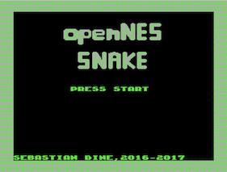
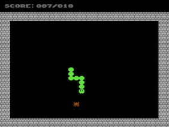
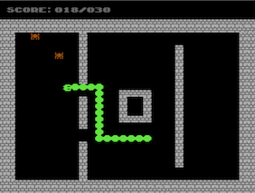

# openNES Snake
## Rebuilding classic games for the NES as Open Source  
  

## Project Description
This project marks the first entry in hopefuly a long line of projects, which attend to rebuild classic video games   
for the Nintendo Entertainment System on an Open Source basis.  
The purpose of these projects is to get more enthusiastic people into programming for the NES by providing code examples
and a starting points for making new games from the scratch.

This particular project aims to rebuild the classic game Snake, also known as Nibbles. Since it is the first of its kind in terms of this project series,
it is stripped down to the core mechanics of the original game, in order to avoid an overhead of information for future beginners
but also because of the lack of knowledge of the main contributor at the time :stuck_out_tongue_winking_eye:.

The project has been coded completely in C, using Shiru's NESLib and the cc65 cross compiler (for further references see the Toolkit section).

## License
This project is licensed under the zlib license. See also the attached README file.

## Toolkit
* [cc65 cross compiler v.2.5](https://github.com/cc65/cc65) - A freeware C compiler for 6502 based systems

* [Shiru's NESLib ](http://shiru.untergrund.net/articles/programming_nes_games_in_c.htm) - An programming library on top of cc65 for more comfortable NES development. See also the more up to date fork [here](https://github.com/clbr/neslib).

* [Eclipse IDE for C/C++ Developers v.4.3 (Kepler)](http://www.eclipse.org/downloads/packages/eclipse-ide-cc-developers/keplersr2) - the famous IDE in its C/C++ variant

* [Tile Molester v.0.16](http://www.romhacking.net/utilities/109/) - A tileset editor, for designing tiles/sprites

* [NES Screen Tool v.2.04](https://shiru.untergrund.net/software.shtml) - A tool that allows to create and edit NES nametables, attributes, palettes, patterns (tiles), and metasprites

* [FamiTracker v.0.4.2](http://famitracker.com) - Famous tracker for producing music for the NES/Famicom-systems

* [Doxygen v.1.8.12](http://www.stack.nl/~dimitri/doxygen/) - Code documentation tool for C/C++ projects

* [FCEUX v.2.2.3](http://www.fceux.com/web/home.html) - Famous NES emulator in the homebrew scene with many debugging utilities.

* [NesDev Forum](http://forums.nesdev.com/) - You will always find friendly, skilled and helpful people in this community, who are willing to help with problems you are facing during your project.

* [Nerdy Nights Tutorials](http://nintendoage.com/pub/faq/NA/index.html?load=nerdy_nights_out.html) - Even if it is based on introducing you to assembly, this is the classic lecture for understanding the NES architecture for many years.

## How-To Built
To build the software into an .NES rom, you need to have installed cc65 on your local machine in order to run eighter the script `build/build.sh` for Linux based systems or build/build.bat` for Windows based systems. You always find a build of the master-branch at `build/snake.nes`.

## Notes for Contributors
Feel free to fork this project and extend its content. If you find bugs, please submit them as issues so we can discuss together how you can fix them. 
All your contributions need to include explaining Doxygen comments in order to share your knowledge with future contributors and maintaining the project's code documentation.
